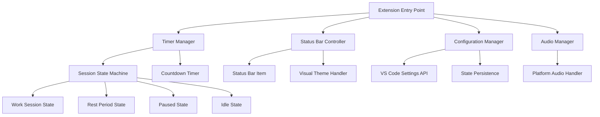

# Design Document

## Overview

The Work Session Manager extension follows the VS Code Extension API architecture, implementing a timer-based system that manages work sessions and rest periods. The extension uses VS Code's status bar API for UI display, workspace configuration for settings persistence, and the extension context for state management. The design emphasizes minimal resource usage, cross-platform compatibility, and seamless integration with the VS Code ecosystem.

## Architecture

### Core Components



### Extension Lifecycle

1. **Activation**: Extension activates on VS Code startup
2. **Initialization**: Load saved state, register commands, create status bar items
3. **Runtime**: Handle timer events, user interactions, and state transitions
4. **Deactivation**: Save current state, cleanup resources

## Components and Interfaces

### Timer Manager

**Purpose**: Core business logic for session and rest period management

**Key Methods**:
- `startSession()`: Initiates a work session
- `startRest()`: Initiates a rest period
- `pause()`: Pauses current timer
- `resume()`: Resumes paused timer
- `reset()`: Resets timer to idle state
- `getCurrentState()`: Returns current timer state

**State Machine**:
```typescript
enum TimerState {
    IDLE = 'idle',
    WORK_SESSION = 'work_session',
    REST_PERIOD = 'rest_period',
    PAUSED = 'paused'
}

interface TimerContext {
    currentState: TimerState;
    remainingTime: number;
    sessionDuration: number;
    restDuration: number;
    pausedAt?: Date;
}
```

### Status Bar Controller

**Purpose**: Manages VS Code status bar integration and visual display

**Key Methods**:
- `updateDisplay(state: TimerContext)`: Updates status bar content
- `showPlayButton()`: Displays play control
- `showPauseButton()`: Displays pause control
- `applyTheme(colors: ThemeColors)`: Applies user color preferences
- `toggleVisibility(options: VisibilityOptions)`: Controls element visibility

**Display Format**:
- Work Session: `● 25:00 ⏸️` (green dot, countdown, pause button)
- Rest Period: `● 05:00 ⏸️` (red dot, countdown, pause button)
- Paused: `⏸️ 15:30 ▶️` (pause icon, remaining time, play button)

### Configuration Manager

**Purpose**: Handles user settings and preferences

**Configuration Schema**:
```typescript
interface ExtensionConfig {
    sessionDuration: number; // minutes (1-120)
    restDuration: number; // minutes (1-60)
    workSessionColor: string; // hex color or name
    restPeriodColor: string; // hex color or name
    soundEnabled: boolean;
    showCountdown: boolean;
    showStatusDot: boolean;
    autoStartRest: boolean;
    autoStartWork: boolean;
}
```

**Default Values**:
- Session Duration: 25 minutes
- Rest Duration: 5 minutes
- Work Color: `#4CAF50` (green)
- Rest Color: `#F44336` (red)
- Sound: Enabled
- All visibility options: Enabled

### Audio Manager

**Purpose**: Handles cross-platform audio notifications

**Key Methods**:
- `playSessionEndSound()`: Plays work session completion sound
- `playRestEndSound()`: Plays rest period completion sound
- `isAudioSupported()`: Checks platform audio capabilities

**Platform Implementation**:
- Uses VS Code's built-in audio capabilities where available
- Falls back to system beep on platforms without audio support
- Respects system volume and accessibility settings

## Data Models

### Timer State Persistence

```typescript
interface PersistedState {
    currentState: TimerState;
    remainingTime: number;
    sessionStartTime?: Date;
    lastActiveTime: Date;
    sessionCount: number;
    totalWorkTime: number;
}
```

**Storage Location**: VS Code workspace state or global state depending on user preference

### Configuration Storage

Uses VS Code's configuration API with the following structure:

```json
{
    "workSessionManager.sessionDuration": 25,
    "workSessionManager.restDuration": 5,
    "workSessionManager.workSessionColor": "#4CAF50",
    "workSessionManager.restPeriodColor": "#F44336",
    "workSessionManager.soundEnabled": true,
    "workSessionManager.showCountdown": true,
    "workSessionManager.showStatusDot": true,
    "workSessionManager.autoStartRest": true,
    "workSessionManager.autoStartWork": false
}
```

## Error Handling

### Timer Synchronization

**Issue**: System sleep or VS Code suspension can cause timer drift
**Solution**: Compare actual elapsed time with expected time on resume, adjust accordingly

### Audio Playback Failures

**Issue**: Audio may not be available on all platforms
**Solution**: Graceful degradation to visual-only notifications with user feedback

### Configuration Validation

**Issue**: Invalid user configuration values
**Solution**: Validate all inputs, provide sensible defaults, show error messages for invalid values

### State Corruption

**Issue**: Persisted state may become corrupted
**Solution**: Implement state validation on load, reset to default if corruption detected

## Testing Strategy

### Unit Tests

**Timer Logic**:
- State transitions (idle → work → rest → work)
- Pause/resume functionality
- Time calculations and countdown accuracy
- Configuration validation

**Status Bar Display**:
- Correct formatting of time display
- Color application based on state
- Button state changes (play/pause)
- Visibility toggle functionality

### Integration Tests

**VS Code API Integration**:
- Status bar item creation and updates
- Configuration reading and writing
- Command registration and execution
- Extension activation/deactivation

**Cross-Platform Testing**:
- Audio playback on Windows, macOS, Linux
- File system permissions for state persistence
- Theme integration across different VS Code themes

### Manual Testing Scenarios

1. **Basic Workflow**: Start session → work period → automatic rest → manual resume
2. **Interruption Handling**: Pause during work → close VS Code → reopen → verify state restoration
3. **Configuration Changes**: Modify settings during active session → verify immediate application
4. **Edge Cases**: Very short durations (1 minute), very long durations (120 minutes)
5. **Accessibility**: Screen reader compatibility, high contrast themes

### Performance Testing

**Memory Usage**: Monitor extension memory footprint during long-running sessions
**CPU Usage**: Ensure timer updates don't impact VS Code performance
**Startup Time**: Measure extension activation impact on VS Code startup

### Automated Testing Pipeline

- Unit tests run on every commit
- Integration tests run on pull requests
- Cross-platform tests run on release candidates
- Performance benchmarks run weekly

## Implementation Notes

### VS Code Extension Manifest

The extension requires the following VS Code API permissions:
- Status bar access for UI display
- Configuration access for user settings
- Workspace state for persistence
- Commands for user interactions

### Backward Compatibility

The extension will maintain compatibility with VS Code versions 1.60.0 and above, ensuring broad user base support while leveraging modern API features.

### Localization Considerations

While not in the initial scope, the design supports future localization by:
- Separating display strings from logic
- Using VS Code's localization framework
- Designing time formats to be culture-aware